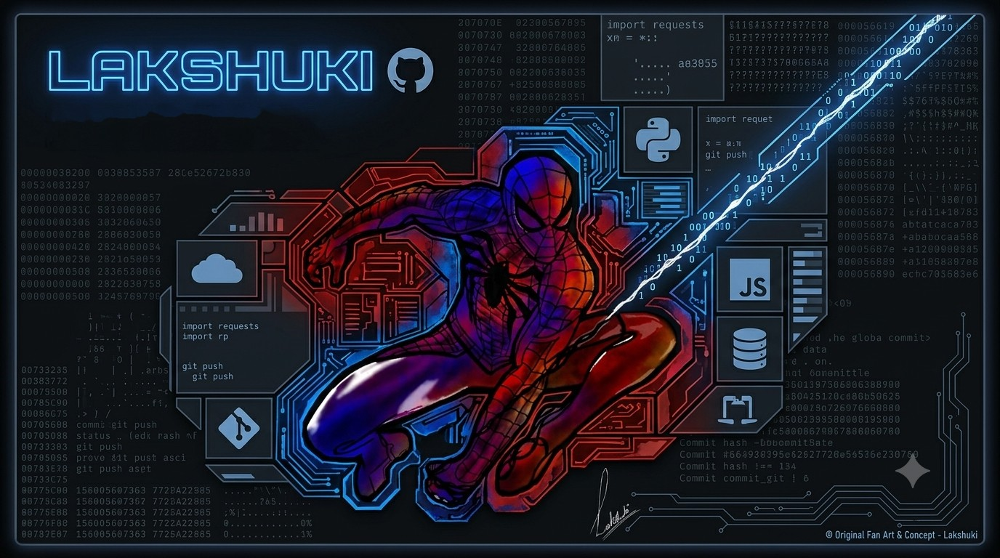
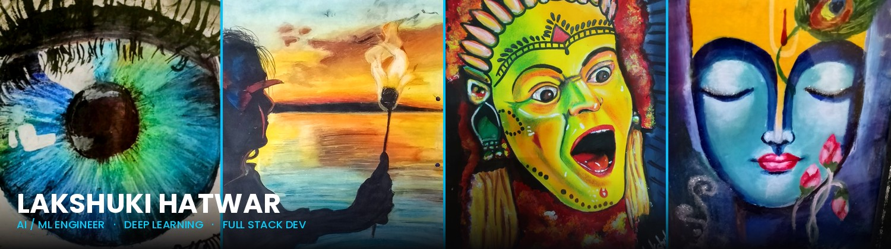

 

# Hi, I'm Lakshuki Hatwar  (～￣▽￣)～

### B.Tech CSE (AI & ML) Student at IIIT Nagpur

 

*The banner above is an original Spider-Man artwork created by me.*

---

#  About Me

I'm currently pursuing my B.Tech in **Computer Science and Engineering (AI & ML)** at **IIIT Nagpur**.

I enjoy building projects that combine artificial intelligence with practical software engineering. My interests include **Machine Learning, Deep Learning, Large Language Models**, and developing full-stack AI applications.

Outside coding, I spend a lot of time drawing and painting. Art has taught me patience, observation, and attention to detail—qualities that also influence how I approach software development.

# Featured Projects

<table>
<tr>

<td width="50%" valign="top">

###  RA-WOA

**Reinforcement-Adaptive Whale Optimization Algorithm**

An enhanced Whale Optimization Algorithm that combines adaptive search strategies with reinforcement learning concepts to improve optimization performance.

**Tech**

`Python` `NumPy` `Optimization Algorithms`

</td>

<td width="50%" valign="top">

###  Icarus-X

**AI-Powered Space Weather Forecasting**

A machine learning platform for forecasting space weather events with an interactive dashboard for monitoring and visualization.

**Tech**

`Python` `FastAPI` `React` `PostgreSQL`

</td>

</tr>

<tr>

<td width="50%" valign="top">

###  Pravah

**AI Travel Planner**

An AI-powered travel planning platform that generates personalized itineraries using Google Gemini and location-based recommendations.

**Tech**

`FastAPI` `React` `Gemini API` `Docker` `Google Maps API`

</td>

<td width="50%" valign="top">

### Parkify

**Smart Parking Management System**

A full-stack parking management application that helps users discover and reserve parking spaces while providing administrators with parking management features.

**Tech**

`React` `Node.js` `Express` `MongoDB`

</td>

</tr>

</table>

---

# Tech Stack

### Languages

### AI / Machine Learning

**Also working with**

`CNNs` • `Transformers` • `LangChain` • `Hugging Face` • `RAG`

### Full Stack

### Databases & Tools

---

---

#  Currently Learning

- Large Language Models (LLMs)
- Retrieval-Augmented Generation (RAG)
- MLOps 
- AI System Design

---

#  Beyond Coding

Drawing and painting are a big part of who I am. Whether it's digital illustrations or traditional artwork, I enjoy creating things from scratch—the same mindset I bring to software development.

You can find some of my artwork on Instagram:
** @anamikaaa_art**

---

---

#  Connect With Me

 

**lakshukihatwar@gmail.com**

**LinkedIn:**  
https://www.linkedin.com/in/lakshuki-hatwar-a80090324

 **Art Profile:**  
https://www.instagram.com/anamikaaa_art

 

---

